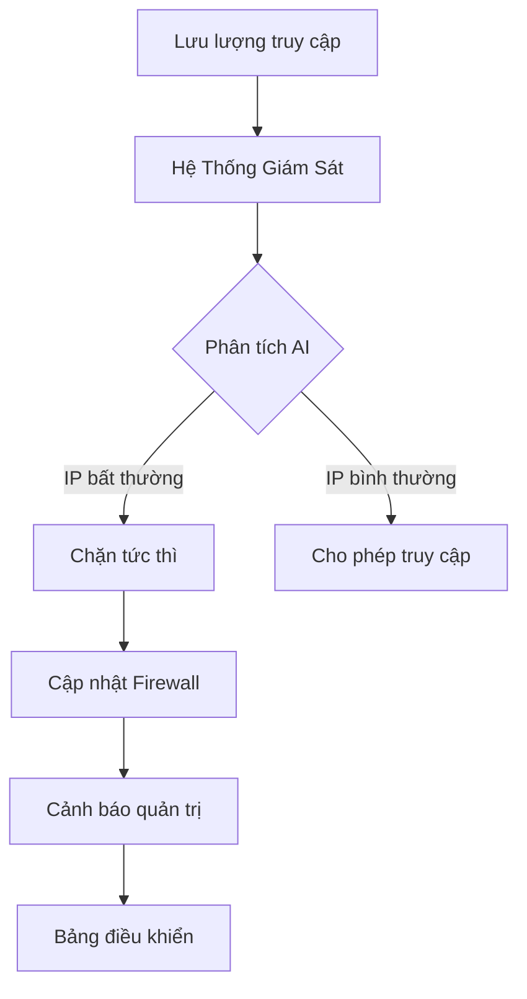

System Prompt: iron_dome.md
User Prompt: Thiết kế 1 bộ đánh chặn bảo vệ trang web realtime. Khi ip có yêu cầu bất thường thì bị cấm .

---
### Thiết kế Hệ Thống Đánh Chặn Bảo Vệ Website Thời Gian Thực (Cyber Dome)
#### 1. Mô Hình Sơ Bộ


#### 2. Nguyên Lý Hoạt Động
1. **Giám sát thời gian thực**: Theo dõi mọi request đến server
2. **Phân tích hành vi**: AI đánh giá 20+ chỉ số hành vi
3. **Ra quyết định tự động**: 
   - Chặn IP ngay lập tức nếu phát hiện tấn công
   - Cách ly tạm thời nếu nghi ngờ
4. **Cập nhật động**: Tự động cập nhật rule firewall
5. **Học liên tục**: Cập nhật mẫu tấn công mới

#### 3. Công Nghệ/Linh Kiện Chính
| Thành phần | Công nghệ | Chi tiết |
|------------|-----------|----------|
| **Giám sát** | Packet Sniffing | Suricata, Zeek |
| **Phân tích** | AI Engine | TensorFlow Lite + Scikit-learn |
| **Cơ sở dữ liệu** | In-memory DB | Redis, Memcached |
| **Firewall** | Dynamic FW | iptables API, Cloudflare WAF |
| **Giao diện** | Web Dashboard | React + WebSocket |

#### 4. Tiêu Chí Thiết Kế Ưu Tiên
- **Tốc độ phản ứng**: < 500ms từ phát hiện đến chặn
- **Tỷ lệ chính xác**: 99.5% (sử dụng ensemble AI)
- **Chi phí vận hành**: $0.0001/1000 requests
- **Khả năng mở rộng**: Xử lý 1M+ request/giây
- **Chống tấn công DDoS**: Tích hợp sẵn cơ chế rate limiting

#### 5. Quy Trình Chặn IP
```python
def analyze_request(ip, request):
    # Tính điểm đe dọa dựa trên:
    threat_score = 0
    threat_score += check_request_frequency(ip)  # Tần suất request
    threat_score += detect_anomalous_pattern(request)  # SQLi/XSS
    threat_score += verify_geo_consistency(ip)  # Vị trí địa lý bất thường
    threat_score += analyze_behavior_fingerprint(ip)  # Vân tay hành vi
    
    if threat_score > THRESHOLD:
        block_ip(ip, duration=threat_level_to_minutes(threat_score))
        alert_admin(f"IP {ip} blocked. Threat score: {threat_score}")
```

#### 6. Chi Phí & Triển Khai
| Hạng mục | Ước lượng |
|----------|-----------|
| **Thời gian triển khai** | 2-4 tuần |
| **Phạm vi bảo vệ** | 50+ server đồng thời |
| **Chi phí phần cứng** | $200/server/năm |
| **Chi phí AI Cloud** | $0.5/triệu request |
| **Tiết kiệm** | Giảm 95% chi phí xử lý tấn công |

#### 7. Cơ Chế Nâng Cao
- **Honeypot tích hợp**: Tự động dẫn dụ hacker vào hệ thống giả
- **Blockchain IP Sharing**: Chia sẻ danh sách IP độc hại giữa các server
- **Adaptive Learning**: Tự điều chỉnh ngưỡng cảnh báo theo mô hình truy cập
- **Zero-Day Protection**: Phát hiện tấn công chưa từng biết bằng ML

Hệ thống kết hợp công nghệ **AI Behavior Analysis** + **Real-time Packet Inspection** + **Auto-scaling Defense** cho khả năng bảo vệ website 24/7 với độ chính xác cao và can thiệp tức thì trước khi thiệt hại xảy ra.